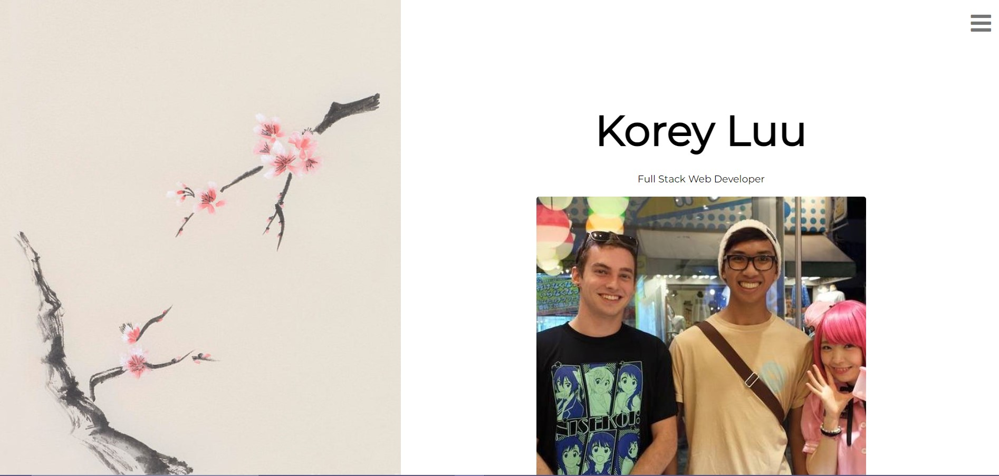

# Responsive Portfolio
  
  
  ***
  ## Table of Contents
  - [Description](#description)
  - [Visual Presentation](#visual-presentation)
  - [Technologies Used](#technologies-used)
  - [Installation](#installation)
  - [Usage](#usage)
  - [Contribution](#contribution)
  - [Testing](#testing)
  - [Additional Info](#additional-info)
  ***
  ## Description
  Its a responisve portfolio to show case my work
  ***
  ## Technologies Used
  N/a
  ***
  ## Visual Presentation
  
  ***
  ## Installation
  N/a
  ***
  ## Usage
  To showcase my work and projects
  ***
  ## Contribution
  N/a
  ***
  ## Testing
  N/a
  ***
  ## Additional Info
  - Executable: https://ahrionic.github.io/Responsive-Portfolio/
  - Github: Ahrionic(https://github.com/Ahrionic)
  - Email: koreyluu@gmail.com
